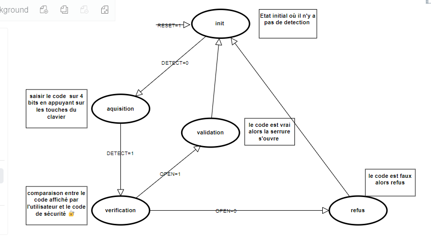

# Système de contrôle d'une serrure électronique

Projet VHDL & Fpga

## Introduction

Dans le cadre des enseignements des circuits logique programmable , et
plus précisément dans le projet VHDL, nous avons choisi d’implémenter un "système de contrôle d’une serrure à combinaison électronique ".

Cette architecture doit être implémentée sur une carte FPGA De10-lite, possédant des afficheurs sept segments et en utilisant un clavier de 16 touches numériques , ce projet a pour but de modéliser en langage VHDL un circuit de serrure à combinaison électronique.

## Diagramme

## Fonctionnemt du projet

Le projet de modélisation d'une serrure à combinaison électronique en
langage VHDL vise à concevoir un système sécurisé nécessitant l'entrée
d'un code confidentiel composé de quatre chiffres à partir d'un clavier
numérique à 16 touches. Chaque touche du clavier est associée à un bit
du bus de données binaire de 16 bits (data_in). Le codeur surveille en
permanence le bus de données, capturant les quatre premières touches pressées successivement pour former le code. Le système de vérification compare ensuite le code entré avec un code prédéfini. En cas de correspondance, le mécanisme de déverrouillage est activé, symbolisé par un signal de déverrouillage. La simulation avec Modelsim permet de valider le fonctionnement du système, testant divers scénarios pour assurer la fiabilité de la serrure électronique dans des conditions variées.

## Docs

Vous trouverez tous les détails dans le rapport pdf.

[Rapport (.pdf)](docs/Rapport.pdf)